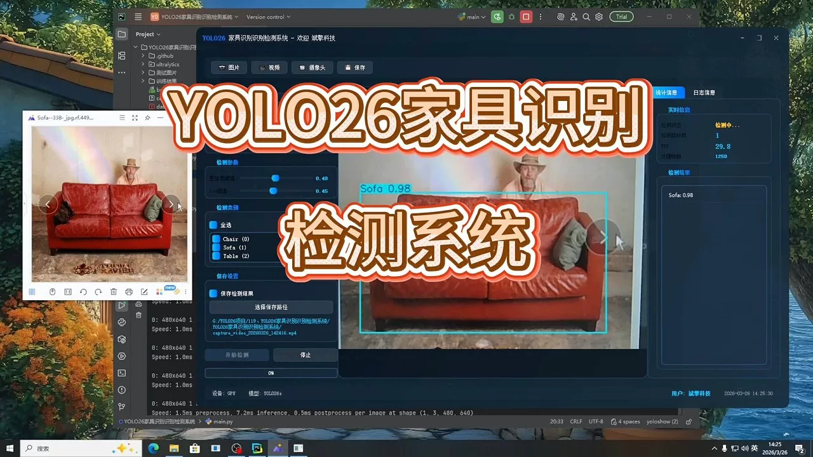
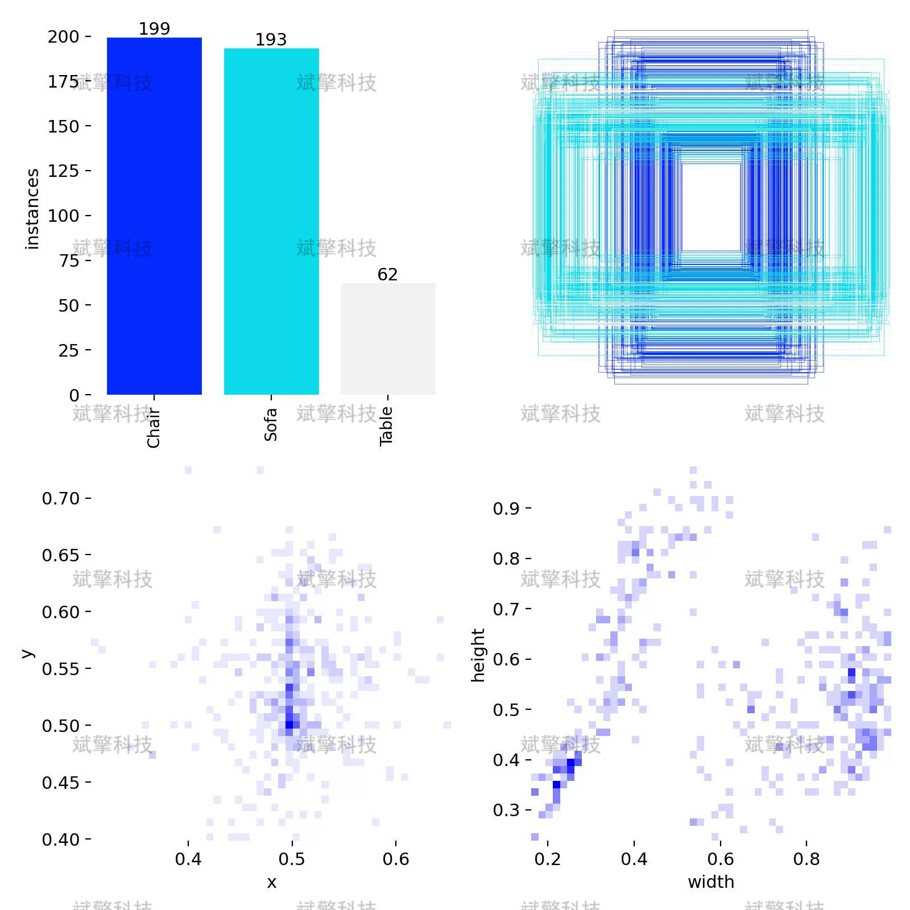
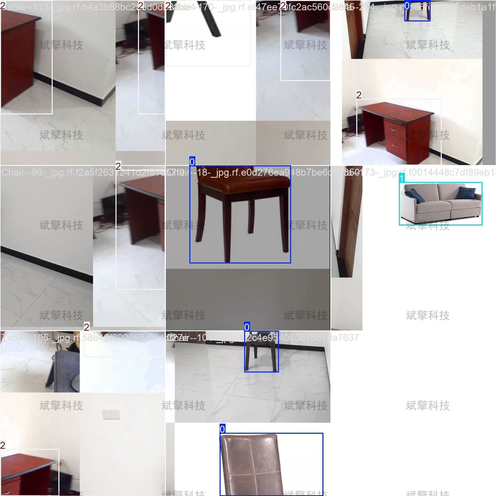
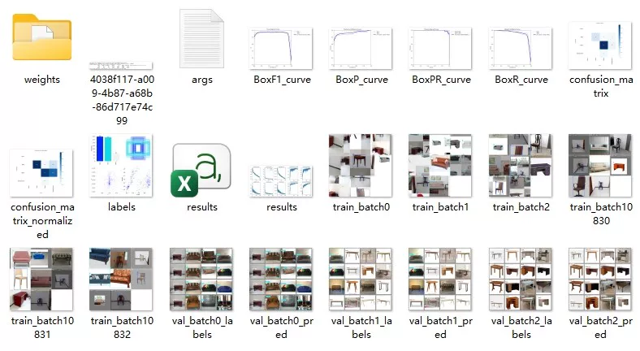
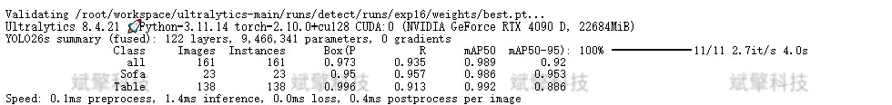
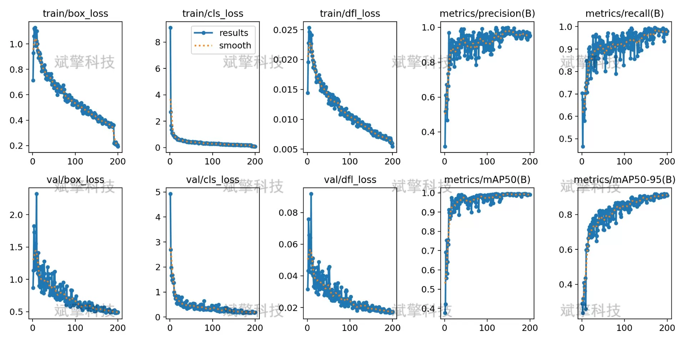
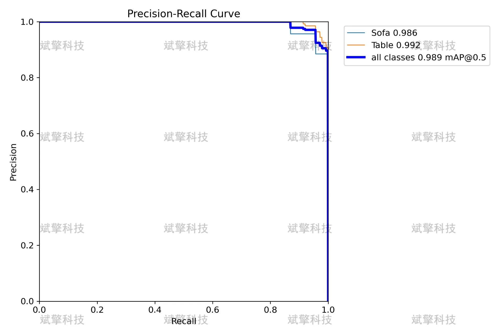
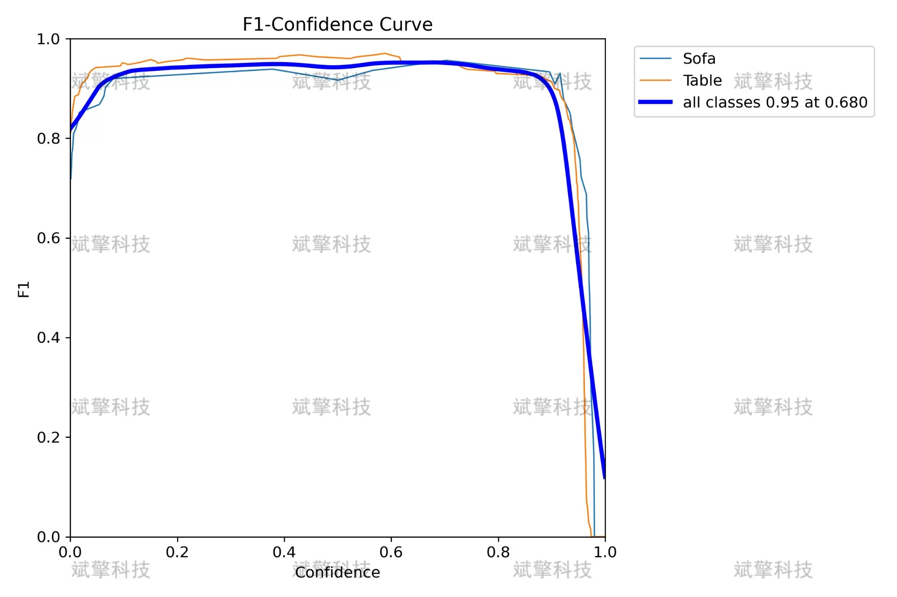
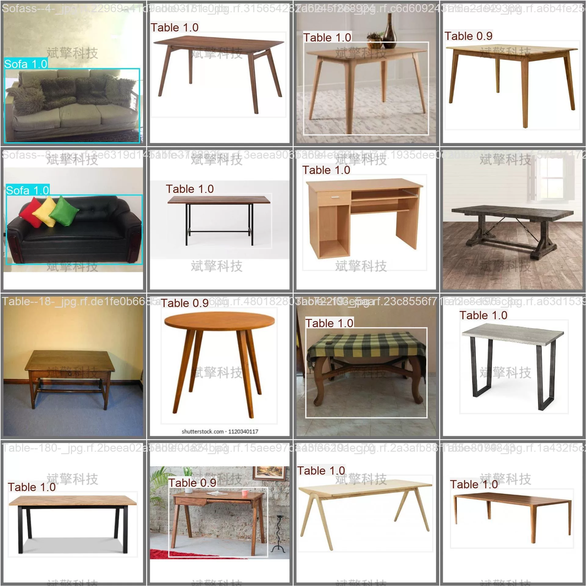

# YOLO26 Furniture Recognition System | Source Code + UI Interface

## Body

YOLO26 Furniture Recognition System | Source Code + UI Interface

With the rapid development of smart home and computer vision technology, furniture recognition detection systems have important application value in indoor scene understanding, smart home control, virtual home arrangement, and other fields. This paper builds a recognition detection system for three common types of furniture (chairs, sofas, tables) based on the YOLO26 object detection algorithm. The experimental dataset contains 689 indoor scene images, including 454 training images, 161 validation images, and 74 test images. After 100 rounds of training, the model achieved excellent performance with mAP50 reaching 0.989 and mAP50-95 reaching 0.920 on the validation set. Among them, the mAP50 for sofas is 0.986, the mAP50 for tables is 0.992, and the detection effect for chairs is also good. The experimental results show that the model has high detection accuracy and robustness in complex indoor environments, meeting practical application needs.

Including three furniture categories: Chairs (Chair), Sofas (Sofa), and Tables (Table)
Training set: 454 images, used for model parameter learning
Validation set: 161 images, used for model performance evaluation and hyperparameter tuning
Test set: 74 images, used for final model performance testing

Free reservation for remote installation. Unsuccessful full refund.
Purchase Enjoy the following resources (Baidu Drive automatically unlocked)
   YOLO Recognition Detection Project Complete Source Code
   YOLO format dataset
    Training code + UI interface code
    Trained model + result images
    Software installer package
    Add WeChat to make a reservation for remote installation (Automatically display WeChat ID after purchase) - Unsuccessful, full refund

⚙️ Core Function Modules
Detection Capability
    Image detection: upload and check immediately, return detection box + category information
    Video detection: supports video files, analyze each frame accurately
    Camera real-time detection: connect USB camera, realize dynamic monitoring
Interaction and Control
    Target selection: freely choose one or more categories for detection
    Parameter real-time adjustment: adjustable confidence threshold & IoU threshold, flexible control precision
    Result saving: image/video/camera detection results saved instantly
System and Data
    User login registration: Support password strength detection + encrypted storage
    Log recording: automatically record operation and error information (with timestamp)

## Images

## Payment

Here is a pay link on Stripe ( https://buy.stripe.com/3cs8yP7sY87d0vu9AB ). Please contact me lonlonago@foxmail.com after funding $89, and I will send you a complete data files , thank you!

